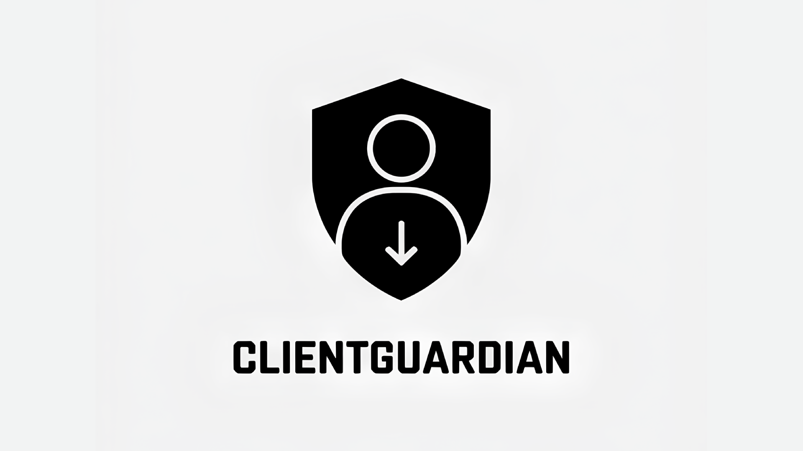

# О проекте
ClientGuardian - проект разработанный специально для ОАО "РЖД", нацеленный на формирование прогнозной модели оттока действующих клиентов. 

# Проблема
На сегодняшний день аналитика по модели перспективного поведения клиентов (увеличение/уменьшение грузоперевозок, увеличение/уменьшение доходов) прорабатывается вручную на основании доступной информации. При текущей организации процесса не предоставляется возможным формирование новой бизнес-модели работы сотрудника с учётом минимизации рутинных процессов и подготовки предиктивных мероприятий, направленных на удержание действующих клиентов .
