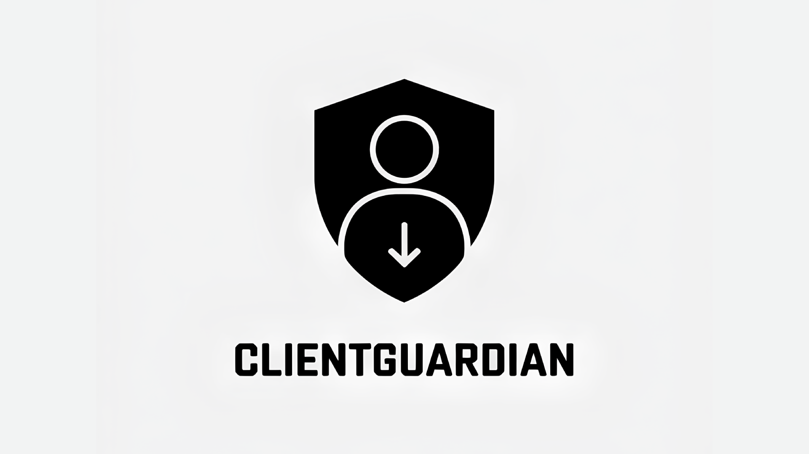

# О проекте
ClientGuardian - проект разработанный специально для ОАО "РЖД", нацеленный на формирование прогнозной модели оттока действующих клиентов. 

# Проблема
На сегодняшний день аналитика по модели перспективного поведения клиентов (увеличение/уменьшение грузоперевозок, увеличение/уменьшение доходов) прорабатывается вручную на основании доступной информации. При текущей организации процесса не предоставляется возможным формирование новой бизнес-модели работы сотрудника с учётом минимизации рутинных процессов и подготовки предиктивных мероприятий, направленных на удержание действующих клиентов .

# Как пользоваться?
- ## Установка зависимостей
    1. [Установите poetry](./.docs/POETRY_INSTALL.md)
    2. Войдите в виртуальное окружение: `poetry shell`
    3. Установите зависимости: `poetry install`

- ## Запуск
    `python src/app.py`

# Вклад в развитие
Вклад в развитие ClientGuardian приветствуется! Если вы обнаружите какие-либо проблемы или у вас есть идеи по улучшению, не стесняйтесь открывать проблему или отправлять запрос на слияние.

# Лицензия
ClientGuardian распространяется под лицензией MIT. \
Подробнее смотрите в файле [LICENSE](LICENSE).